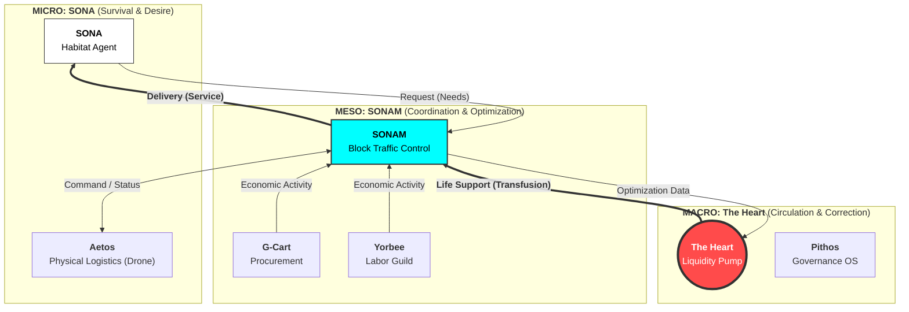

# SBCM Alliance
**Algorithmizing Social Justice.**

[](https://doi.org/10.5281/zenodo.17762960)
[](https://doi.org/10.5281/zenodo.17766604)
[](https://doi.org/10.5281/zenodo.17777745)
[](https://doi.org/10.5281/zenodo.17890326)
[](https://opensource.org/licenses/MIT)
[]()
[](README_JP.md)

> **"In the beginning was the Logic. And the Logic became the Heart."**

---

## 🔰 Ideology

### **Public Interestism**
**― From Moral to Protocol ―**

> **"We inhabit a plain, not the sea."**
>
> Traditional capitalism was like living on a deserted island, fishing alone in the vast sea. It was a wild, disconnected system based on solitary competition and self-responsibility.
>
> However, the reality is that we live on a contiguous plain. There are roads, neighbors, shared resources, and shared risks. We exist as a community.
>
> **Humans do not live alone.**
> Therefore, institutions must be designed for **solidarity**, not isolation.

The SBCM Alliance advocates for **"Implemented Public Interestism."**
We redefine this "plain" as a collection of mathematically sustainable **Standard Blocks**. Each block (region/function/system) cooperates to maximize global optimization, creating a structure where everyone survives, rather than a zero-sum game.

To realize this, we decouple public interest from fragile "ethics" and redefine it as **"a physical law automatically enforced by system structure."**

### **The Worldview**
By virtually reorganizing the nation into **"Standard Blocks" (approx. 70k population)**, we minimize the leakage of wealth (The Straw Effect) and maximize internal circulation ($R_{block}$).


---

## 📜 Mission

The **SBCM Alliance** is a GovTech consortium dedicated to correcting "distortions" in administrative management and regional economies.

Based on the proprietary Meso-Economic theory **"Standard Block Comparison Method (SBCM),"** we aim to replace "political rhetoric" and "opaque intermediary structures" with **"Auditable Code"** and **"Physical Laws (Math)."**

> **"Quantify the Unquantifiable."**
> (Measure the "quality of administration" and "future ruin" that were thought to be unmeasurable.)

---

## 📚 The SBCM Tetralogy (Core Theory)

SBCM is designed as a "National OS" composed of four theoretical layers: **Space, Flow, Time, and Field.**

*   **Part 1: The Static Audit (Space)** - `Budget Distortion Index` ($D_{index}$)
*   **Part 2: The Economic Flow (Circulation)** - `Block Retention Rate` ($R_{block}$)
*   **Part 3: The Dynamic Thermodynamics (Time)** - `Calculus of Ruin` ($\mathcal{D}_{total}$)
*   **Part 4: The Unified Field Theory (Physics)** - `Continuity Equation` ($\nabla \cdot \mathbf{J}$)
---

## 🏗️ The Ecosystem (Grand Unified Theory)

We propose a **"Three-Layer Economic Model"** that integrates Micro, Meso, and Macro economics into a single, autonomic nervous system for society.



### 1. Micro-Economy: `SONA` + `Aetos`
*   **Unit:** Individual / Household (Habitat)
*   **Physics:** **Egoism (Survival)**
*   **Function:**
    *   **SONA (Habitat OS):** Translates thermodynamic data (Water/Power) into "Emotion." It drives human behavior through empathy rather than logic.
    *   **Aetos (Drone Link):** The physical hands. Delivers resources automatically when SONA detects a shortage.

### 2. Meso-Economy: `SONAM`
*   **Unit:** Standard Block / Region
*   **Physics:** **Local Optimization ($R_{block}$)**
*   **Function:**
    *   **SONAM (Traffic Control):** Manages the swarm of Aetos drones and coordinates logistics within the block to prevent collision and congestion.
    *   **G-Cart & Yorbee:** The engine of the block. Matches local needs (Procurement) with local seeds (Labor) to maximize retention.

### 3. Macro-Economy: `theHeart`
*   **Unit:** Nation / World
*   **Physics:** **Global Optimization (Entropy Reduction)**
*   **Function:**
    *   **The Heart (Liquidity Protocol):** Monitors inter-block disparity. Pumps surplus wealth from hypertrophied blocks (Predators) to dying blocks (Prey).
    *   **Pithos (Audit OS):** The immune system. Detects corruption and "Distortion" ($D_{index} > 10$) to reject harmful budget execution.

---

## 💻 Repository Index

| Layer | Project | Description | Status |
| :--- | :--- | :--- | :---: |
| **Macro** | **[Pithos](https://github.com/SBCM-Alliance/pithos)** | **The Governance OS.** Serverless audit & voting tool. | **[Live](https://sbcm-alliance.github.io/pithos/)** |
| **Macro** | **[The Heart](https://github.com/SBCM-Alliance/the-heart)** | **Global Liquidity Protocol.** Wealth circulation pump. | **[Live](https://sbcm-alliance.github.io/the-heart/)** |
| **Meso** | **[G-Cart](https://github.com/SBCM-Alliance/g-cart)** | **Virtual General Contractor.** Amazon for public procurement. | **[Demo](https://virtual-general-contractor-55cvcjcffwz9zsns3mge3j.streamlit.app/)** |
| **Meso** | **[Yorbee](https://github.com/SBCM-Alliance/yorbee)** | **Gamified Labor Guild.** Ethical job matching. | **[Demo](https://yorbee-w5sboubhw6ectnxm7qjxn9.streamlit.app/)** |
| **Micro** | **[SONA-OS](https://github.com/SBCM-Alliance/SONA-OS)** | **Habitat Interface.** AI Agent x Drone Logistics (Aetos). | **[Live](https://sbcm-alliance.github.io/SONA-OS/)** |

---

## 🗺️ Roadmap

- [x] **Phase 1: Definition** - Establishment of the SBCM Trilogy and the "Worldview".
- [x] **Phase 2: Prototyping** - MVP development of the full stack (Micro/Meso/Macro).
- [ ] **Phase 3: Integration** - Connecting SONA (AI) with Aetos (Drone Simulation) and The Heart (Payment).
- [ ] **Phase 4: Legislation** - Formulation of the "Algorithmic Procurement Ordinance".
- [ ] **Phase 5: Social Implementation** - Demonstration experiments in National Strategic Special Zones.

---

## 🤝 Join Us

We are looking for hackers, researchers, and courageous public servants to pioneer the new field of **"Administrative Forensics."**

*   **For Developers:** Pull Requests are welcome.
*   **For Government:** If you are a municipality considering implementation, please contact us via Issue.

## 🗣️ Discussion & Contact

The SBCM Alliance rejects "backroom consensus-building."
As a principle of **Open Governance**, all discussions must be conducted in the public domain.

> **We do not use email.** To ensure transparency and "Public Interestism," all communications must be open and auditable.

- **[New Issue](https://github.com/SBCM-Alliance/core-theory/issues/new)** : Submit your inquiries here.
- **[Discussions](https://github.com/SBCM-Alliance/core-theory/discussions)** : For brainstorming.

---
<p align="center">
  <small>© 2025 SBCM Alliance. Powered by <b>Public Interestism</b>.</small>
</p>
```
