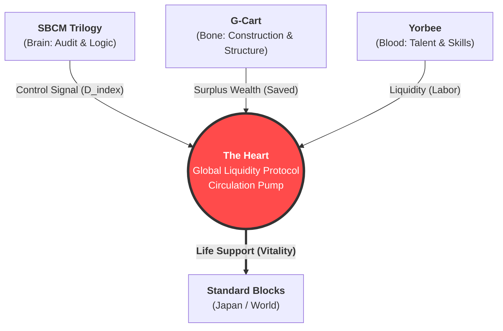

# SBCM Alliance
**Algorithmizing Social Justice.**

[](https://doi.org/10.5281/zenodo.17762960)
[](https://doi.org/10.5281/zenodo.17777745)
[](https://opensource.org/licenses/MIT)
[]()
[](README_JP.md)

> **"In the beginning was the Logic. And the Logic became the Heart."**

---

## 🔰 Ideology

### **Public Interestism**
**― From Moral to Protocol ―**

> **"We inhabit a plain, not the sea."**
>
> Traditional capitalism was like living on a deserted island, fishing alone in the vast sea. It was a wild, disconnected system based on solitary competition and self-responsibility.
>
> However, the reality is that we live on a contiguous plain. There are roads, neighbors, shared resources, and shared risks. We exist as a community.
>
> **Humans do not live alone.**
> Therefore, institutions must be designed for **solidarity**, not isolation.

The SBCM Alliance advocates for **"Implemented Public Interestism."**
We redefine this "plain" as a collection of mathematically sustainable **Standard Blocks**. Each block (region/function/system) cooperates to maximize global optimization, creating a structure where everyone survives, rather than a zero-sum game.

To realize this, we decouple public interest from fragile "ethics" and redefine it as **"a physical law automatically enforced by system structure."**

*   **The Old Way:** Relying on "good people" to do politics to make the world better. (Vulnerable to corruption)
*   **The SBCM Way:** Creating a structure where **even "bad actors" mathematically maximize the public interest.** (Robust & Auditable)

---

## 📜 Mission

The **SBCM Alliance** is a GovTech consortium dedicated to correcting "distortions" in administrative management and regional economies.

Based on the proprietary Meso-Economic theory **"Standard Block Comparison Method (SBCM),"** we aim to replace "political rhetoric" and "opaque intermediary structures" with **"Auditable Code"** and **"Physical Laws (Math)."**

> **"Quantify the Unquantifiable."**
> (Measure the "quality of administration" and "future ruin" that were thought to be unmeasurable.)

---

## 📚 The SBCM Trilogy (Core Theory)

SBCM is designed as a "National OS" composed of three theoretical layers: **Space, Flow, and Time.**

### **Part 1: The Static Audit (Space)**
**[Proposal for SBCM in Administrative Evaluation](https://doi.org/10.5281/zenodo.17762960)**
*   **Core Logic:** `Budget Distortion Index` ($D_{index}$)
*   **Function:** Detects "budgetary distortion" by normalizing administrative data with population scale. It automatically flags "Quadrant 4" projects (High Cost / Low Reach).

### **Part 2: The Economic Flow (Circulation)**
**[SBCM Economics: Meso-Economic Framework](https://doi.org/10.5281/zenodo.17766604)**
*   **Core Logic:** `Block Retention Rate` ($R_{block}$) / `SBCM Fiscal Multiplier` ($M_{sbcm}$)
*   **Function:** Maximizes "Wealth Retention" instead of GDP. It mathematically proves that public works with high leakage (Straw Effect) yield zero economic benefit.

### **Part 3: The Dynamic Thermodynamics (Time)**
**[Dynamic Meso-Economics and the Thermodynamics of Governance](https://doi.org/10.5281/zenodo.17777745)**
*   **Core Logic:** `Cumulative Distortion Integral` ($\mathcal{D}_{total}$)
*   **Function:** A "Calculus of Ruin." It proves that in a depopulating society ($P(t) \searrow$), fixing infrastructure costs ($C(t) \nearrow$) causes the burden to diverge to infinity ($\infty$).

$$ \lim_{t \to \infty} \int_{0}^{t} \frac{C(\tau)}{P(\tau)} \, d\tau = \infty $$

---

## 🏗️ The Ecosystem (Implementation)

We do not just propose theories; we develop and publish applications to implement them socially. These components form a closed-loop economic system.



| Project | Type | Description | Status |
| :--- | :---: | :--- | :---: |
| **[The Heart](https://github.com/SBCM-Alliance/the-heart)** | 🫀 Core | **Global Liquidity Protocol.**<br>An algorithmic pump that detects state distortion and injects liquidity (Work) into dying blocks. | **[Live](https://sbcm-alliance.github.io/the-heart/)** |
| **[G-Cart](https://github.com/SBCM-Alliance/g-cart)** | 🏗️ System | **Virtual General Contractor.**<br>Amazon-ifying public procurement to eliminate the "Straw Effect" and force local retention. | **Demo** |
| **[Yorbee](https://github.com/SBCM-Alliance/yorbee)** | ⚔️ Platform | **Job-Deconstruction Skills Guild.**<br>An RPG-style recruitment app that physically rejects exploitative contracts. | **Demo** |

---

## 🗺️ Roadmap

- [x] **Phase 1: Definition** - Establishment of the SBCM Trilogy (Audit, Economics, Dynamics) and DOI acquisition.
- [x] **Phase 2: Prototyping** - MVP development of G-Cart, Yorbee, and The Heart simulation.
- [ ] **Phase 3: Legislation** - Formulation of the "Algorithmic Procurement Ordinance" (Model Ordinance).
- [ ] **Phase 4: Social Implementation** - Demonstration experiments in National Strategic Special Zones.

---

## 🤝 Join Us

We are looking for hackers, researchers, and courageous public servants to pioneer the new field of **"Administrative Forensics."**

*   **For Developers:** Pull Requests are welcome.
*   **For Government:** If you are a municipality considering implementation, please contact us via Issue.

## 🗣️ Discussion & Contact

The SBCM Alliance rejects "backroom consensus-building."
As a principle of **Open Governance**, all discussions must be conducted in the public domain.

Media inquiries, technical questions, and consultation requests are all accepted via **GitHub Issues**.

> **We do not use email.** To ensure transparency and "Public Interestism," all communications must be open and auditable.

- **[New Issue](https://github.com/SBCM-Alliance/core-theory/issues/new)** : Submit your inquiries here. (Japanese/English accepted)
- **[Discussions](https://github.com/SBCM-Alliance/core-theory/discussions)** : For brainstorming and general conversation.

---
<p align="center">
  <small>© 2025 SBCM Alliance. Powered by <b>Public Interestism</b>.</small>
</p>
```
