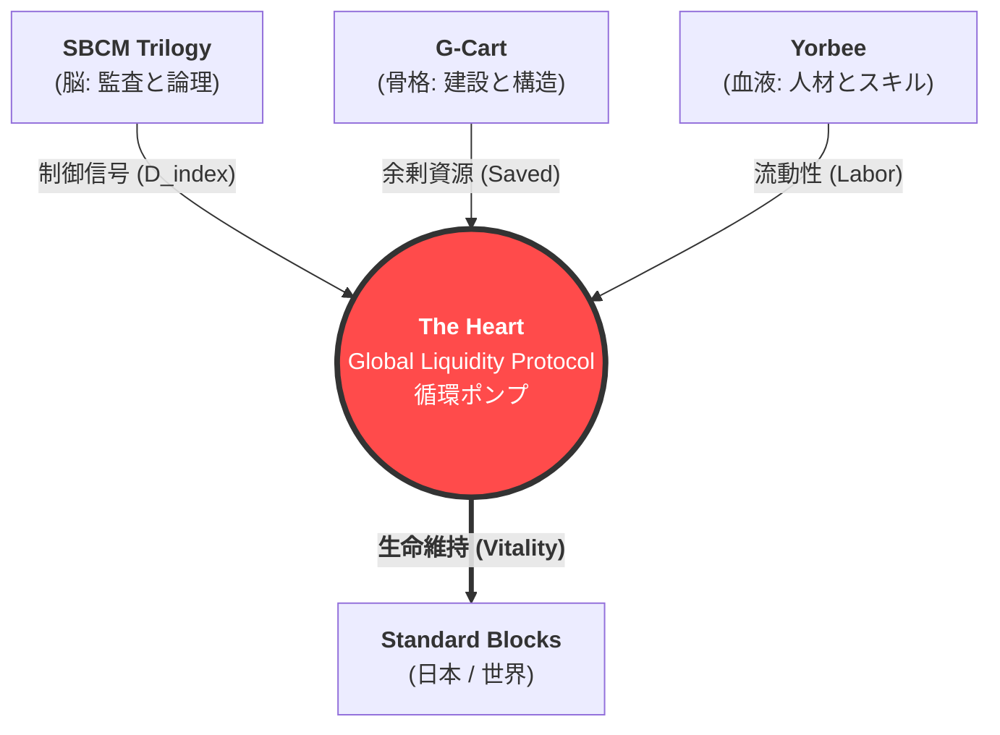

# SBCM Alliance
**Algorithmizing Social Justice.** (社会正義をアルゴリズム化する)

> **"In the beginning was the Logic. And the Logic became the Heart."**
> （初めに論理ありき。そして論理は心となった。）

---

## 🔰 Ideology (理念)

### **Public Interestism**
**― 道徳からプロトコルへ ―**

> **「我々は『海』ではなく『平原』に住んでいる」**
>
> 従来の資本主義は、絶海の孤島で、たった一人で魚を釣るようなモデルでした。それは孤独な競争と自己責任に基づく、荒々しいシステムでした。
>
> しかし現実には、私たちは地続きの平原に住んでいます。隣人がいて、道路があり、共有すべき資源とリスクがあります。私たちは共同体（コミュニティ）として存在しています。
>
> **人間は一人では生きられない。**
> したがって、社会システムは「孤立」ではなく**「連帯」**のために設計されなければなりません。

SBCM Alliance は、**「実装された公益主義 (Implemented Public Interestism)」** を提唱します。
私たちはこの平原を、数学的に持続可能な **「標準ブロック (Standard Blocks)」** の集合体として再定義します。各ブロック（地域・機能・システム）が全体最適のために協力し、ゼロサムゲームではなく「全員が生存できる構造」を構築します。

これを実現するために、私たちは「公益」を脆い「倫理観」から切り離し、**「システム構造によって自動強制される物理法則」** として再定義します。

*   **旧来の道徳:** 「良い人」が政治を行えば、世の中は良くなるはずだ。（腐敗に脆弱）
*   **SBCMの道徳:** **「悪人」でさえも、数学的に公益を最大化せざるを得ない構造を作る。**（堅牢かつ監査可能）

---

## 📜 Mission (使命)

**SBCM Alliance** は、行政経営および地域経済における「歪み」を是正するための GovTech コンソーシアムです。

独自のメソ経済理論 **「標準ブロック比較法 (SBCM)」** に基づき、政治的なレトリックや不透明な中抜き構造を、**「監査可能なコード」** と **「物理法則（数学）」** に置き換えることを目的としています。

> **"Quantify the Unquantifiable."**
> （測定不能と思われていた「行政の質」と「未来の破綻」を、数学的に定義する。）

---

## 📚 The SBCM Trilogy (理論体系)

SBCMは3つの論文によって構成される、「国家OS」の設計図です。

### **Part 1: The Static Audit (現在)**
**[行政施策の定量的評価における標準ブロック比較法 (SBCM) の提案](https://doi.org/10.5281/zenodo.17762960)**
*   **Core Logic:** `予算歪み指数` ($D_{index}$)
*   **機能:** 行政データを人口規模で正規化し、「予算の歪み」を検知する監査論。第4象限（高コスト・低普及）の無駄を自動的にあぶり出す。

### **Part 2: The Economic Flow (空間)**
**[SBCM経済学：富の定着と循環を最大化するメソ経済フレームワーク](https://doi.org/10.5281/zenodo.17766604)**
*   **Core Logic:** `ブロック残留率` ($R_{block}$) / `SBCM財政乗数` ($M_{sbcm}$)
*   **機能:** GDP（総量）ではなく「富の定着」を最大化する経済論。漏出（ストロー効果）の激しい公共事業は、経済効果がゼロであることを数学的に証明する。

### **Part 3: The Dynamic Thermodynamics (未来)**
**[SBCM経済学 Part 2: 動的メソ経済学と統治の熱力学](https://doi.org/10.5281/zenodo.17777745)**
*   **Core Logic:** `累積歪み積分` ($\mathcal{D}_{total}$)
*   **機能:** 「時間の重力」を扱う熱力学。人口減少下 ($P(t) \searrow$) においてインフラコストを固定 ($C(t) \nearrow$) すれば、将来負担は無限大 ($\infty$) に発散し、自治体は物理的に崩壊することを証明する。

$$ \lim_{t \to \infty} \int_{0}^{t} \frac{C(\tau)}{P(\tau)} \, d\tau = \infty $$

---

## 🏗️ The Ecosystem (実装)

理論を現実に適用するためのアプリケーション群です。これらは有機的に結合し、**「The Heart」**を中心とした自律経済圏を形成します。

| Project | Type | Description | Status |
| :--- | :---: | :--- | :---: |
| **[Pithos](https://github.com/SBCM-Alliance/pithos)** | 🏺 OS | **論理のOS。** スマホのブラウザだけで動作する、サーバーレスの統治ツール。監査(Core)、金庫(Treasurer)、追放(Ostraka)の機能を備え、市民に「権力に対抗する武器」を与える。 | **[Live](https://sbcm-alliance.github.io/pithos/)** |
| **[The Heart](https://github.com/SBCM-Alliance/the-heart)** | 🫀 Core | **Global Liquidity Protocol.** 富の偏在を調整し、瀕死のブロックへ「仕事」として輸血する自律分散ポンプ。 | **[Live](https://sbcm-alliance.github.io/the-heart/)** |
| **[G-Cart](https://github.com/SBCM-Alliance/g-cart)** | 🏗️ System | **Virtual General Contractor.** 公共調達のAmazon。中抜き（ストロー効果）を排除し、地域内循環を強制する。 |  **[Demo](https://virtual-general-contractor-55cvcjcffwz9zsns3mge3j.streamlit.app/)** |
| **[Yorbee](https://github.com/SBCM-Alliance/yorbee)** | ⚔️ Platform | **Gamified Skill Guild.** 職務をスキルに分解し、パーティを組んでクエストを解決する分散型労働市場。 | **[Demo](https://yorbee-w5sboubhw6ectnxm7qjxn9.streamlit.app/)** |

---

## 🗺️ Roadmap (ロードマップ)

- [x] **Phase 1: Definition** - SBCM三部作（監査・経済・動態）の確立とDOI取得。
- [x] **Phase 2: Prototyping** - MVP開発（Pithos, G-Cart, Yorbee, The Heart）。
- [ ] **Phase 3: Legislation** - 「アルゴリズム調達条例」の策定（モデル条例案）。
- [ ] **Phase 4: Social Implementation** - 国家戦略特区等での実証実験開始。

---

## 🤝 Join Us (参画)

私たちは、新しい分野 **「行政鑑識学 (Administrative Forensics)」** の開拓者を求めています。

*   **エンジニアの方:** コードで国をデバッグしたい方。Pull Requestをお待ちしています。
*   **研究者の方:** メソ経済学を拡張・検証したい方。
*   **行政・自治体の方:** 「持続可能な自治体」へ脱皮したい首長・職員の方。Issueよりご連絡ください。

## 🗣️ Discussion & Contact

SBCM Alliance は「密室での合意形成」を否定します。
**オープン・ガバナンス** の原則に基づき、すべての議論は公の場で行われます。

取材依頼、技術的な質問、導入相談はすべて **GitHub Issues** にて受け付けています。

> **メールは使用しません。** 透明性と公益性を担保するため、すべてのコミュニケーションは公開され、監査可能である必要があります。

- **[New Issue](https://github.com/SBCM-Alliance/core-theory/issues/new)** : お問い合わせはこちらから。（日本語/英語可）
- **[Discussions](https://github.com/SBCM-Alliance/core-theory/discussions)** : 雑談やブレインストーミングはこちら。

---

  <small>© 2025 SBCM Alliance. Powered by <b>Public Interestism</b>.</small>

