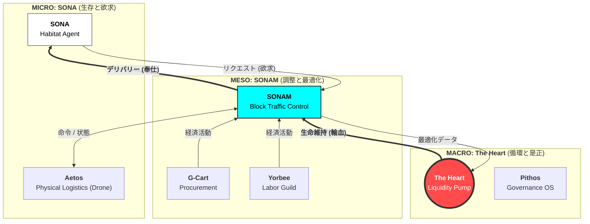

# SBCM Alliance
**Algorithmizing Social Justice.** (社会正義をアルゴリズム化する)

[](https://doi.org/10.5281/zenodo.17762960)
[](https://doi.org/10.5281/zenodo.17766604)
[](https://doi.org/10.5281/zenodo.17777745)
[](https://doi.org/10.5281/zenodo.17890326)
[](https://opensource.org/licenses/MIT)
[]()
[](README.md)

> **"In the beginning was the Logic. And the Logic became the Heart."**
> （初めに論理ありき。そして論理は心となった。）

---

## 🔰 Ideology (理念)

### **Public Interestism**
**― 道徳からプロトコルへ ―**

> **「我々は『海』ではなく『平原』に住んでいる」**
>
> 従来の資本主義は、絶海の孤島で、たった一人で魚を釣るようなモデルでした。それは孤独な競争と自己責任に基づく、荒々しいシステムでした。
>
> しかし現実には、私たちは地続きの平原に住んでいます。隣人がいて、道路があり、共有すべき資源とリスクがあります。私たちは共同体（コミュニティ）として存在しています。
>
> **人間は一人では生きられない。**
> したがって、社会システムは「孤立」ではなく**「連帯」**のために設計されなければなりません。

SBCM Alliance は、**「実装された公益主義 (Implemented Public Interestism)」** を提唱します。
私たちはこの平原を、数学的に持続可能な **「標準ブロック (Standard Blocks)」** の集合体として再定義します。各ブロック（地域・機能・システム）が全体最適のために協力し、ゼロサムゲームではなく「全員が生存できる構造」を構築します。

これを実現するために、私たちは「公益」を脆い「倫理観」から切り離し、**「システム構造によって自動強制される物理法則」** として再定義します。

### **The Worldview (世界観)**
全国を**「標準ブロック（約7万人規模）」**という仮想単位に再編することで、富の漏出（ストロー効果）を最小化し、地域内循環（ $R_{block}$ ）を最大化します。


---

## 📜 Mission (使命)

**SBCM Alliance** は、行政経営および地域経済における「歪み」を是正するための GovTech コンソーシアムです。

独自のメソ経済理論 **「標準ブロック比較法 (SBCM)」** に基づき、政治的なレトリックや不透明な中抜き構造を、**「監査可能なコード」** と **「物理法則（数学）」** に置き換えることを目的としています。

> **"Quantify the Unquantifiable."**
> （測定不能と思われていた「行政の質」と「未来の破綻」を、数学的に定義する。）

---

## 📚 The SBCM Tetralogy (理論体系)

SBCMは4つの論文によって構成される、「国家OS」の設計図です。

*   **Part 1: The Static Audit (空間)** - `予算歪み指数` ( $D_{index}$ )
*   **Part 2: The Economic Flow (循環)** - `ブロック残留率` ( $R_{block}$ )
*   **Part 3: The Dynamic Thermodynamics (時間)** - `破綻の微積分` ( $\mathcal{D}_{total}$ )
*   **Part 4: The Unified Field Theory (場)** - `富の連続の式` ( $\nabla \cdot \mathbf{J}$ )
---

## 🏗️ The Ecosystem (実装：大統一理論)

ミクロ、メソ、マクロ経済を一つの自律神経系として統合する**「三層経済モデル」**を提案します。



### 1. ミクロ経済 (Micro): `SONA` + `Aetos`
*   **単位:** 個人 / 家計 (Habitat)
*   **物理法則:** **エゴイズム (生存欲求)**
*   **機能:**
    *   **SONA (Habitat OS):** 水や電気のデータを「感情」に翻訳する。論理ではなく共感によって人の行動を変容させる。
    *   **Aetos (Drone Link):** 物理的な手足。SONAが欠乏を検知すると、自動的に物資を空輸する。

### 2. メソ経済 (Meso): `SONAM`
*   **単位:** 標準ブロック / 地域
*   **物理法則:** **局所最適化 ($R_{block}$)**
*   **機能:**
    *   **SONAM (Traffic Control):** 無数のAetosドローンを管制し、ブロック内の物流を衝突なくコーディネートする。
    *   **G-Cart & Yorbee:** ブロックのエンジン。地域の需要（調達）と供給（労働）をマッチングさせ、富の定着を最大化する。

### 3. マクロ経済 (Macro): `theHeart`
*   **単位:** 国家 / 世界
*   **物理法則:** **全体最適化 (エントロピー減少)**
*   **機能:**
    *   **The Heart (Liquidity Protocol):** ブロック間の格差を監視。肥大化したブロック（捕食者）から富を吸い上げ、瀕死のブロック（被食者）へ輸血するポンプ。
    *   **Pithos (Audit OS):** 免疫システム。腐敗や「歪み ($D_{index} > 10$)」を検知し、有害な予算執行を拒絶する。

---

## 💻 Repository Index (リポジトリ一覧)

| Layer | Project | Description | Status |
| :--- | :--- | :--- | :---: |
| **Macro** | **[Pithos](https://github.com/SBCM-Alliance/pithos)** | **論理のOS。** サーバーレスの監査・投票ツール。 | **[Live](https://sbcm-alliance.github.io/pithos/)** |
| **Macro** | **[The Heart](https://github.com/SBCM-Alliance/the-heart)** | **富の循環ポンプ。** 格差是正プロトコル。 | **[Live](https://sbcm-alliance.github.io/the-heart/)** |
| **Meso** | **[G-Cart](https://github.com/SBCM-Alliance/g-cart)** | **バーチャル・ゼネコン。** 公共調達のAmazon。 | **[Demo](https://virtual-general-contractor-55cvcjcffwz9zsns3mge3j.streamlit.app/)** |
| **Meso** | **[Yorbee](https://github.com/SBCM-Alliance/yorbee)** | **スキルギルド。** 中抜きのない労働市場。 | **[Demo](https://yorbee-w5sboubhw6ectnxm7qjxn9.streamlit.app/)** |
| **Micro** | **[SONA-OS](https://github.com/SBCM-Alliance/SONA-OS)** | **ハビタット接続。** AIエージェント × ドローン物流。 | **[Live](https://sbcm-alliance.github.io/SONA-OS/)** |

---

## 🗺️ Roadmap (ロードマップ)

- [x] **Phase 1: Definition** - SBCM三部作の確立と「世界観」の定義。
- [x] **Phase 2: Prototyping** - フルスタック（Micro/Meso/Macro）のMVP開発。
- [ ] **Phase 3: Integration** - SONA(AI)とAetos(ドローン)、The Heart(決済)の相互接続。
- [ ] **Phase 4: Legislation** - 「アルゴリズム調達条例」の策定。
- [ ] **Phase 5: Social Implementation** - 国家戦略特区等での実証実験開始。

---

## 🤝 Join Us (参画)

私たちは、新しい分野 **「行政鑑識学 (Administrative Forensics)」** の開拓者を求めています。

*   **エンジニアの方:** コードで国をデバッグしたい方。Pull Requestをお待ちしています。
*   **行政・自治体の方:** 「持続可能な自治体」へ脱皮したい首長・職員の方。Issueよりご連絡ください。

## 🗣️ Discussion & Contact

SBCM Alliance は「密室での合意形成」を否定します。
**オープン・ガバナンス** の原則に基づき、すべての議論は公の場で行われます。

> **メールは使用しません。** 透明性と公益性を担保するため、すべてのコミュニケーションは公開され、監査可能である必要があります。

- **[New Issue](https://github.com/SBCM-Alliance/core-theory/issues/new)** : お問い合わせはこちらから。
- **[Discussions](https://github.com/SBCM-Alliance/core-theory/discussions)** : 雑談やブレインストーミングはこちら。

---
<p align="center">
  <small>© 2025 SBCM Alliance. Powered by <b>Public Interestism</b>.</small>
</p>
```
